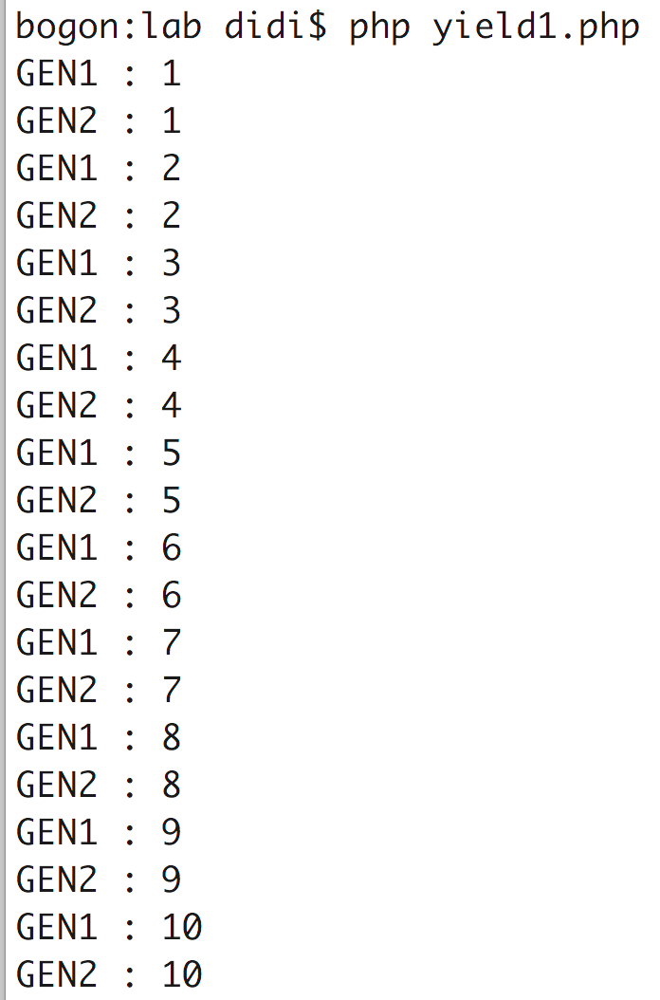

# 2.yield与协程 Generator

在2012年，Nikic就发表了一篇关于PHP yield多任务的文章 
<http://nikic.github.io/2012/12/22/Cooperative-multitasking-using-coroutines-in-PHP.html>

+ yield只能用在function中，但用了yield就已经不是传统意义上的function了，同时如果你企图在function之外的其他地方用yield，你会被打脸。
+ yield的最重要作用就是：自己中断一坨代码的执行，然后主动让出CPU控制权给路人甲；然后又能通过一些方式从刚才中断的地方恢复运行。这个就比较屌了，假如你请求了一个费时10s的服务器API，此时是可以让出CPU给路人甲。粗暴地说上面的过程就算是协程的基本概念。


```php
<?php
function gen1() {
  for( $i = 1; $i <= 10; $i++ ) {
    echo "GEN1 : {$i}".PHP_EOL;
    // sleep没啥意思，主要就是运行时候给你一种切实的调度感，你懂么
    // 就是那种“你看！你看！尼玛,我调度了！卧槽”
    sleep( 1 );
    // 这句很关键，表示自己主动让出CPU，我不下地狱谁下地狱
    yield;
  }
}
function gen2() {
  for( $i = 1; $i <= 10; $i++ ) {
    echo "GEN2 : {$i}".PHP_EOL;
    // sleep没啥意思，主要就是运行时候给你一种切实的调度感，你懂么
    // 就是那种“你看！你看！尼玛,我调度了！卧槽”
    sleep( 1 );
    // 这句很关键，表示自己主动让出CPU，我不下地狱谁下地狱
    yield;
  }
}
$task1 = gen1();
$task2 = gen2();
while( true ) {
  // 首先我运行task1，然后task1主动下了地狱
  echo $task1->current();
  // 这会儿我可以让task2介入进来了
  echo $task2->current();
  // task1恢复中断
  $task1->next();
  // task2恢复中断
  $task2->next();
}
```




你要知道，如果function gen1和function gen2中没有yield，而是普通函数，你是无法中断其中的for循环的，

### 正常的效果应该是
```text
GEN1: 1
GEN1: 2
GEN1: 3
....
GEN1: 10
GEN2: 1
GEN2: 2
GEN2: 3
....
GEN2: 10

```


## yield 与 CURL


```php
<?php
$ch1 = curl_init();
// 这个地址中的php，我故意sleep了5秒钟，然后输出一坨json
curl_setopt( $ch1, CURLOPT_URL, "http://www.selfctrler.com/index.php/test/test1" );
curl_setopt( $ch1, CURLOPT_HEADER, 0 );
$mh = curl_multi_init();
curl_multi_add_handle( $mh, $ch1 );
function gen1( $mh, $ch1 ) {
  do {
    $mrc = curl_multi_exec( $mh, $running );
    // 请求发出后，让出cpu
    $rs = yield;
    echo "外部发送数据{$rs}".PHP_EOL;    
  } while( $running > 0 );
  $ret = curl_multi_getcontent( $ch1 );
  echo $ret.PHP_EOL;
  return false;
}
function gen2() {
  for ( $i = 1; $i <= 10; $i++ ) {
    echo "gen2 : {$i}".PHP_EOL;
    file_put_contents( "./yield.log", "gen2".$i, FILE_APPEND );
    $rs = yield;
    echo "外部发送数据{$rs}".PHP_EOL;    
  }
}
$gen1 = gen1( $mh, $ch1 );
$gen2 = gen2();
while( true ) {
  echo $gen1->current();
  echo $gen2->current();
  $gen1->send("gen1");
  $gen2->send("gen2");
}
```

将$gen1->next()修改成了$gen1->send(“gen1”)

在function gen1中yield有了返回值，并且将返回值打印出来

：yield和send，是可以双向通信的，同时告诉我们send可以用来恢复原来中断的代码，而且在恢复中断的同时可以携带信息回去。
