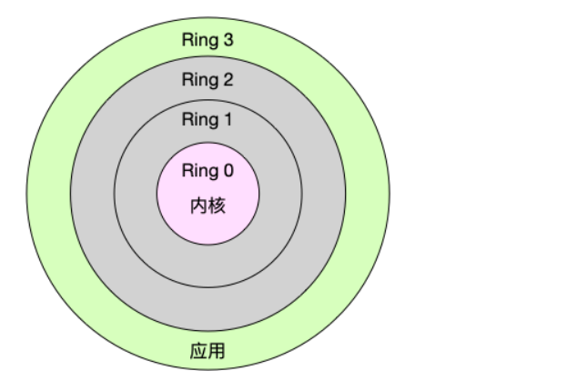

# 什么是进程

Linux 是一个多任务操作系统，它支持远大于 CPU 数量的任务（这里可以直接理解为进程）同时运行。当然，这些任务实际上并不是真的在同时运行，而是因为系统在很短的时间内，将 CPU 轮流分配给它们，造成多任务同时运行的错觉。而在每个任务运行前，CPU 都需要知道任务从哪里加载、又从哪里开始运行（这里任务的运行，就是进程的运行，简单的理解电脑运行一个进程，其实就是解释执行一段源码，而CPU就是真正执行源码的，源码放在内存中的哪一块，这个CPU是要知道的），也就是说，需要系统事先帮它设置好CPU 寄存器和程序计数器

### 1.什么是进程
上面我们讲到进程，那么到底什么是进程呢？进程（有时候也称做任务）是指一个程序运行的实例。在 Linux 系统中，线程就是能并行运行并且与他们的父进程（创建他们的进程）共享同一地址空间（一段内存区域）和其他资源的轻量级的进程。

### 2.什么是 CPU 上下文

CPU 寄存器和程序计数器就是 CPU 上下文，因为它们都是 CPU 在运行任何任务前，必须的依赖环境。上下文

指某一时间点 CPU 寄存器和程序计数器的内容

CPU 寄存器是 CPU 内置的容量小、但速度极快的内存（与之对应的是 CPU 外部相对较慢的 RAM 主内存）。

程序计数器则是一个专用的寄存器，是用来存储 CPU 正在执行的指令位置、或者即将执行的下一条指令位置。

### 3.什么是 CPU 上下文切换

CPU上下文切换就是保存上一个任务运行的寄存器和计数器信息切换到加载下一个任务的寄存器和计数器的过程

就是先把前一个任务的 CPU 上下文（也就是 CPU 寄存器和程序计数器）保存起来，然后加载新任务的上下文到这些寄存器和程序计数器，最后再跳转到程序计数器所指的新位置，运行新任务。

而这些保存下来的上下文，会存储在系统内核中，并在任务重新调度执行时再次加载进来。这样就能保证任务原来的状态不受影响，让任务看起来还是连续运行。

详细解释就是：上下文切换可以认为是内核（操作系统的核心）在 CPU 上对于进程（包括线程）进行以下的活动：（1）挂起一个进程，将这个进程在 CPU 中的状态（上下文）存储于内存中的某处，（2）在内存中检索下一个进程的上下文并将其在 CPU 的寄存器中恢复，（3）跳转到程序计数器所指向的位置（即跳转到进程被中断时的代码行），以恢复该进程。

### 4.CPU 上下文切换的类型

1.进程上下文切换
Linux 按照特权等级，把进程的运行空间分为内核空间和用户空间，分别对应着下图中， CPU 特权等级的 Ring 0 和 Ring 3。

内核空间（Ring 0）具有最高权限，可以直接访问所有资源；

用户空间（Ring 3）只能访问受限资源，不能直接访问内存等硬件设备，必须通过系统调用陷入到内核中，才能访问这些特权资源。

文献来自： <https://www.cnblogs.com/qingbaizhinian/p/13775327.html>
